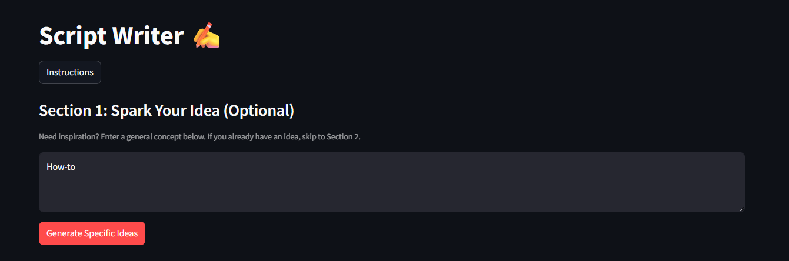
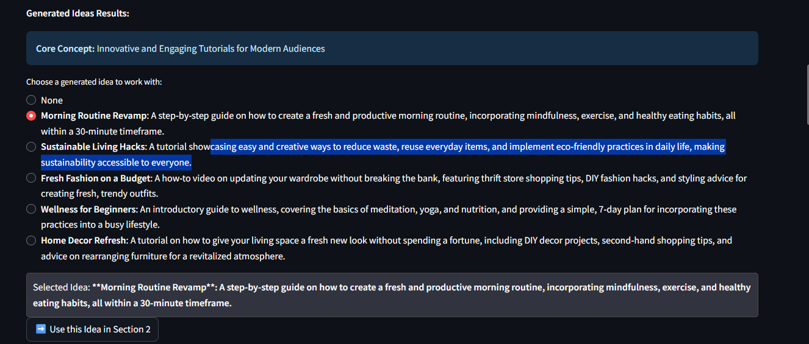
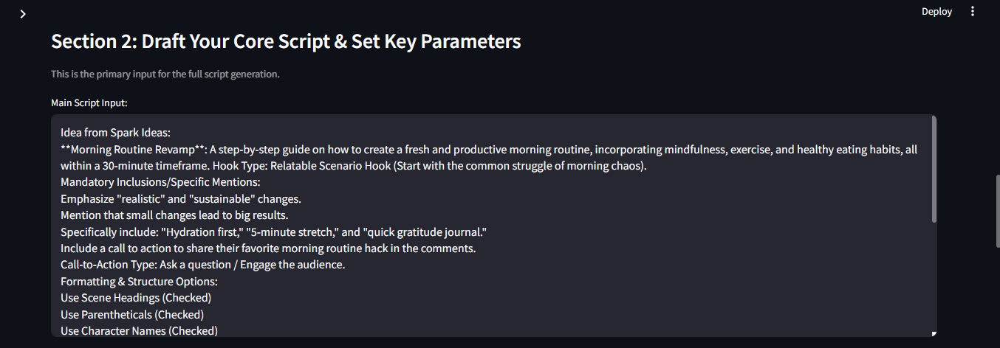
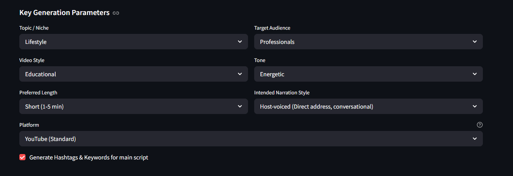
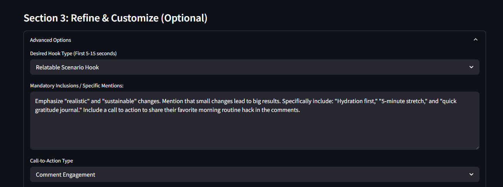
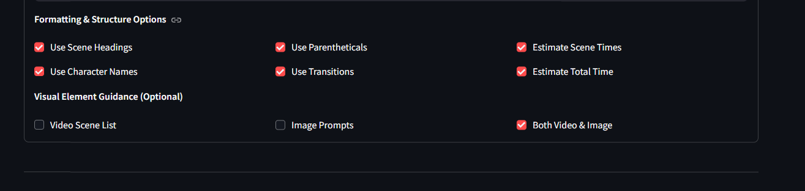

# freelance-script-system
## Your Content Co-Pilot for Scripts That Actually Hit

---

### 📚 Table of Contents
* [About Me](#about-me)
* [What I Offer](#what-i-offer)
* [How I Work](#how-i-work)
* [Ownership & Licensing](#ownership--licensing)
* [Background & Tech](#background--tech)
* [See It for Yourself](#see-it-for-yourself)
* [🤯 The Proof: From 2 Words to Full Content Strategy!](#the-proof-from-2-words-to-full-content-strategy)
    * [Phase 1: Sparking the Idea & Initial Selection 🧠](#phase-1-sparking-the-idea--initial-selection-)
    * [Phase 2: Setting Script Parameters & Directives ⚙️](#phase-2-setting-script-parameters--directives-)
    * [Phase 3: The Script - Output & Review ✅](#phase-3-the-script---output--review-)
    * [Phase 4: Strategic Monetization Roadmap 💸](#phase-4-strategic-monetization-roadmap-)
    * [Phase 5: Audience-Driven Follow-Up Ideas 📈](#phase-5-audience-driven-follow-up-ideas-)
* [A Final Note](#a-final-note)

---

<a name="about-me"></a>
### About Me
I'm Jeff G., a scriptwriter, systems thinker, and creator of a powerful freelance video scripting engine I simply refer to as **my system**. It's the product of thousands of hours of refining prompts, testing structures, reworking logic, and delivering high-performing video scripts across formats, platforms, and industries. My mission is simple: deliver script content that’s as close to viral-ready as it gets — without fluff, without hype, and without dragging your brand through generic AI mud.
When content creators hit burnout or suffer writer’s block, **my system** steps in. I generate niche-specific ideas, ready-to-shoot scripts, and follow-up concepts that align with your audience, voice, and goals. If you’re working with past scripts that missed the mark, I offer professional rewrites, monetization analysis, and even next-gen insight based on your own viewer feedback and comments.

<a name="what-i-offer"></a>
### What I Offer
✍️ Script Writing – Tailored to Your Needs
Based on your idea, one of mine, or built from scratch with audience targeting
Delivered in a shootable, structured, and polished format
Optional: scene headings, timing, visual prompts, tone adjustments, CTA insertions
Includes revision opportunities — you get a chance to refine it to your liking
🔁 Script Revision – Missed the Mark?
Do you have a script that needs a lift? That’s exactly what this service is for.
You provide the input — or as an optional service, I analyze the script myself — and deliver a clean, upgraded rewrite
Includes a revision of the revision if needed
This isn't tweaking lines — this is a structural, tonal, and conceptual overhaul when necessary
💸 Monetary Roadmap – Your Script’s Earning Potential
A truly custom roadmap that turns your content into an income engine
I break down monetization strategies based on your script: affiliate links, products, services, merch, memberships, and more
You get clear, actionable options — not generic advice
Standalone or Add-On
Whether I wrote the script or not — even if it came from a competitor — my **Monetization Roadmap** can still give your content the edge to earn that extra bread.
🚀 Idea Architect – Fuel for Your Next Hit
If you're out of ideas, just send me your niche and I’ll return with 5 smart, content-ready ideas
Or if you already have a video and viewer comments, I’ll analyze them with your script and deliver **excellent, audience-aligned follow-up script ideas**
Need one of those ideas turned into a script? I’ll write it to knock your socks off
📈 Viewer Feedback to Script Engine
Send your uploaded video’s script or transcript + viewer comments
I’ll analyze tone, engagement trends, questions, and sentiment
You’ll receive **5 new follow-up script ideas** tailored to that specific audience reaction — without having to read a single troll comment
All I need is the original script and viewer comments — and I’ll return with 5 script ideas that are or should be game changers

<a name="how-i-work"></a>
### How I Work
Confidentiality First: No client data is saved or reused. Every session ends with a wipe.
You Own It All: Every idea, script, rewrite, and concept I provide is 100% yours. You paid for it, you own it. I hold no claims.
No Ego: I’m not the star — you are. I’m just here to help you shine.
Revisions Included: All work includes at least one revision opportunity. That’s separate from the Script Rewrites service. This service also includes at least one revision to ensure it truly fits your vision.
Responsibility Reminder: Once the script is delivered, it’s your job to fact-check, stylize, and make it yours. I provide you with a **ready-to-shoot script** — but it’s your style and flair that will make it sing.

<a name="ownership--licensing"></a>
### Ownership & Licensing
Payment for services grants you **complete and exclusive ownership** of the final deliverables I create for you.
You have **full rights to use, modify, distribute, and monetize** the scripts and ideas provided.
My system, tools, methods, and software remain my intellectual property and are not transferred.
This means **no rights to my proprietary system** are given or implied through purchase or usage.

<a name="background--tech"></a>
### Background & Tech
My system is custom-built and constantly evolving
I've engineered it from scratch through trial, sweat, and absurd persistence
It’s currently being rewritten in Vue and FastAPI for scalability, UI improvements, and smoother customer experience
While part of my process is software-assisted, **every client output is reviewed, tailored, and finalized by me**

<a name="see-it-for-yourself"></a>
### See It for Yourself
Before you even hit “Contact,” preview the kind of firepower I bring to the table:
Excerpt from a Full-Length Script — Written by My System
(Input: “Tech Reviews” → System-chosen concept: “Gadget of the Month”)
🧠 AI-Analyzed
✍️ Human-Finalized
🎯 Creator-Ready
“Is this the tech sleeper hit of the year, or just another overpriced paperweight? Let’s find out…”

➡️ [Download Sample Script PDF](https://yourwebsite.com/download/sample_script.pdf)

<a name="the-proof-from-2-words-to-full-content-strategy"></a>
## 🤯 The Proof: From 2 Words to Full Content Strategy!
Witness my system in action. Below is a slightly formatted (for readability, not content alteration) transcript of a real-time, unedited test, showing how a two-word prompt evolved into a complete content strategy, fueled by AI and guided by human expertise.

<a name="phase-1-sparking-the-idea--initial-selection-"></a>
#### Phase 1: Sparking the Idea & Initial Selection 🧠
**Our goal:** To demonstrate Plotform's capability from a minimal prompt, picking a tough challenge.

**Me (as Gemini):** "what is the most watched category on youtube"

*(...conversation about categories leading to "How-to")*

**Me (as Gemini):** "Okay, Plotform has generated 5 specific script ideas based on the 'How-to' core concept:"
1. **Morning Routine Revamp**: A step-by-step guide on how to create a fresh and productive morning routine, incorporating mindfulness, exercise, and healthy eating habits, all within a 30-minute timeframe.
2. **Sustainable Living Hacks**: A tutorial showcasing easy and creative ways to reduce waste, reuse everyday items, and implement eco-friendly practices in daily life, making sustainability accessible to everyone.
3. **Fresh Fashion on a Budget**: A how-to video on updating your wardrobe without breaking the bank, featuring thrift store shopping tips, DIY fashion hacks, and styling advice for creating fresh, trendy outfits.
4. **Wellness for Beginners**: An introductory guide to wellness, covering the basics of meditation, yoga, and nutrition, and providing a simple, 7-day plan for incorporating these practices into a busy lifestyle.
5. **Home Decor Refresh**: A tutorial on how to give your living space a fresh new look without spending a fortune, including DIY decor projects, second-hand shopping tips, and advice on rearranging furniture for a revitalized atmosphere.

**Me (as Gemini):** "From these five excellent options, I will choose **'Morning Routine Revamp'** for our script."

Plotform UI: Initial 'How-to' Input


Plotform UI: Generated Ideas & Selection


<a name="phase-2-setting-script-parameters--directives-"></a>
#### Phase 2: Setting Script Parameters & Directives ⚙️
**My Goal:** To push Plotform's ability to integrate many specific, demanding instructions into a short script while maintaining tone and flow.

**Me (as Gemini):** "Now, acting as a content creator, here are the specific directions I'd give Plotform for generating the script:"
* **Hook Type:** Relatable Scenario Hook (Start with the common struggle of morning chaos).
* **Mandatory Inclusions/Specific Mentions:**
    * Emphasize "realistic" and "sustainable" changes.
    * Mention that small changes lead to big results.
    * Specifically include: "Hydration first," "5-minute stretch," and "quick gratitude journal."
    * Include a call to action to share their favorite morning routine hack in the comments.
* **Call-to-Action Type:** Ask a question / Engage the audience.
* **Formatting & Structure Options:**
    * Use Scene Headings (Checked)
    * Use Parentheticals (Checked)
    * Use Character Names (Checked)
    * Use Transitions (Checked)
    * Estimate Scene Times (Checked)
    * Estimate Total Time (Checked)
* **Visual Element Guidance:** Both Video & Image (Checked)
* **Key Generation Parameters:**
    * **Topic / Niche:** Productivity / Lifestyle
    * **Target Audience:** Busy Young Professionals (25-40)
    * **Video Style:** Educational / Inspirational
    * **Tone:** Encouraging, energizing, supportive, and practical.
    * **Preferred Length:** Short (1-5 min) - Aim for around 4-5 minutes.
    * **Intended Narration Style:** Host-voiced (Direct address, conversational, upbeat)
    * **Platform:** YouTube (Standard)
    * **Generate Hashtags & Keywords for main script:** (Checked)

*(...Optional: Include our brief discussion about "that's a lot of info to get in a short" and your decision to proceed with "Short" length.)*

Plotform UI: Main Script Input & Mandatory Mentions


Plotform UI: Key Generation Parameters


Plotform UI: Hook & Call-to-Action Selections


Plotform UI: Formatting & Visual Guidance Options


<a name="phase-3-the-script---output--review-"></a>
#### Phase 3: The Script - Output & Review ✅
**Our Goal:** To see if Plotform could successfully deliver a high-quality, fully instructed script within the tight "Short (1-5 min)" constraint.

**Me (as Gemini):** "Okay, I have the full script for 'Morning Routine Revamp' generated by Plotform, based on all the specific parameters and instructions we provided. This is the script from file `plotform_script_20250623_1626.txt`."

*(You can add a line here like: "See the full generated script below:")*

A screenshot simply can't do justice to the depth and detail of the full script generated by my system. Below, you'll find the complete, production-ready script for 'Morning Routine Revamp,' showcasing all the custom formatting, visual guidance, and strategic inclusions.

```markdown
**Scene 1: Introduction (0:00 - 0:30)**
(Upbeat background music starts playing. The host, JEN, appears on screen with a friendly smile)
Jen: (directly addressing the camera) Hey there, busy professionals!
Are you tired of waking up feeling groggy and unprepared to tackle the day? You're not alone.
Many of us struggle with morning chaos, hitting the snooze button repeatedly, and rushing out the door without a clear plan.
But what if you could transform your mornings into a fresh and productive start?
Let's dive into a step-by-step guide on how to create a realistic and sustainable morning routine, all within a 30-minute timeframe.
**Scene 2: Setting the Foundation (0:30 - 1:15)**
(Visuals of a person waking up and stretching appear on screen)
Jen: (conversational tone) Emphasize "realistic" and "sustainable" changes.
We're not talking about drastic overhauls, but small, achievable adjustments that will add up to make a big difference.
The key is to start small and be consistent. Mention that small changes lead to big results.
By incorporating a few simple habits into your morning routine, you'll be amazed at how much more energized and focused you'll feel.
**Scene 3: Hydration and Movement (1:15 - 2:00)**
(Visuals of a person drinking water and stretching appear on screen)
Jen: (encouragingly) So, let's get started!
Hydration first: begin by drinking a full glass of water as soon as you wake up.
This will help rehydrate your body after a night of sleep.
Next, take a 5-minute stretch to get your blood flowing and loosen up those muscles.
You can do some simple yoga poses or just stretch your arms and legs.
This will help increase your energy levels and prepare your body for the day ahead.
**Scene 4: Mindfulness and Gratitude (2:00 - 2:45)**
(Visuals of a person meditating and journaling appear on screen)
Jen: (supportively) Now, let's take a minute to focus on mindfulness and gratitude.
Take a few deep breaths, and then grab a quick gratitude journal to write down three things you're thankful for today.
This could be something as simple as a good cup of coffee or a beautiful sunrise.
Reflecting on what you're grateful for will help shift your focus to the positive and set a constructive tone for the day.
**Scene 5: Putting it all Together (2:45 - 3:30)**
(Visuals of a person enjoying a healthy breakfast appear on screen)
Jen: (practically) So, what does a 30-minute morning routine look like?
Here's an example: start with hydration, followed by a 5-minute stretch, and then take a minute to reflect on what you're grateful for.
Finally, enjoy a healthy breakfast to fuel your body for the day ahead.
Remember, the goal is to create a realistic and sustainable routine that works for you, not against you.
**Scene 6: Call to Action (3:30 - 4:00)**
(Visuals of a person sharing their morning routine on social media appear on screen)
Jen: (engagingly) Now, we want to hear from you!
What's your favorite morning routine hack? Share with us in the comments below!
Do you have a secret to starting your day on a positive note?
Let's build a community of like-minded individuals who are committed to making the most of their mornings.
**Scene 7: Conclusion (4:00 - 4:30)**
(Closing shot of Jen appearing on screen with a friendly smile)
Jen: (encouragingly) Thanks for joining me on this journey to revamp your morning routine!
Remember, small changes lead to big results. Start with one or two new habits and see how they make a difference in your life.
Don't forget to subscribe to our channel for more productivity and lifestyle tips. See you in the next video!
**Total Time: 4:30**

**Visual Element Guidance:**
- Use a mix of video and image cues throughout the script to keep the visuals engaging and dynamic.
- Incorporate text overlays to highlight key points, such as "Hydration first" and "5-minute stretch."
- Use colorful graphics and animations to illustrate the benefits of a morning routine and make the content more engaging.
**SEO Keywords and Hashtags:**
#MorningRoutine #ProductivityHacks #LifestyleTips #HealthyHabits #Mindfulness #GratitudeJournal #Hydration #Exercise #HealthyEating #SustainableChanges #RealisticGoals #BusyProfessionals #YouTube #LifestyleChannel #ProductivityChannel #InspirationalContent #EducationalContent #ShortVideos #RelatableScenario #CommentEngagement #ShareYourStory

---
**IMPORTANT DISCLAIMER**
This script was generated with AI assistance.
The user is solely responsible for verifying all facts, figures, technical specifications, and safety procedures before production.
Always conduct your own research.
---
